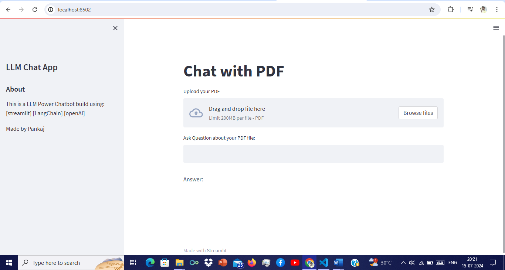

# Q&A PDF Chatbot

This project is a Question and Answer (Q&A) chatbot application built using a Language Learning Model (LLM) that allows users to upload PDF files and interactively ask questions about the content within the PDF. The chatbot leverages Streamlit for the web interface, LangChain for text processing, and OpenAI for generating responses.

### Features
- **PDF Upload:** Users can upload a PDF file.
- **Text Extraction:** The application extracts text from the uploaded PDF.
- **Text Chunking:** The extracted text is split into manageable chunks.
- **Embeddings:** Text chunks are converted into embeddings for similarity search.
- **Interactive Q&A:** Users can input questions related to the PDF content and receive relevant answers.

### Technologies Used
- **Streamlit:** For building the web application.
- **LangChain:** For text processing and handling.
- **OpenAI:** For generating responses using the GPT-3.5-turbo model.
- **PyPDF2:** For extracting text from PDF files.
- **FAISS:** For efficient similarity search.
- **dotenv:** For loading environment variables.
### Usage
- **1.** Run the Streamlit application.
- **2.** Open your web browser and go to http://localhost:8501 to access the application.
- **3.** Upload a PDF file using the file uploader in the sidebar.
- **4.** Once the PDF is uploaded, you can ask questions related to the content of the PDF in the provided text input box.

